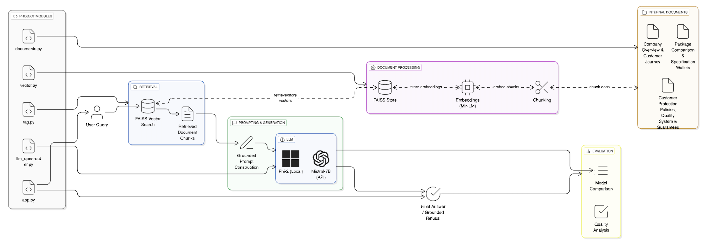

# 🏗️ Indecimal Mini RAG System

A **Retrieval-Augmented Generation (RAG)** based AI assistant for a construction marketplace.  
The system answers user questions **strictly using internal Indecimal documents**, ensuring **grounded, transparent, and explainable responses**.

---

## 🎯 Objective

Build a Mini RAG pipeline that:

- Retrieves relevant information from internal documents
- Generates answers grounded **only** in retrieved content
- Avoids hallucinations and unsupported claims
- Clearly displays retrieved context and final answers
- Demonstrates understanding of RAG, embeddings, vector search, and LLM behavior

---

## 🧠 High-Level RAG Architecture



```
User Query
   │
   ▼
FAISS Vector Search
   │
   ▼
Retrieved Document Chunks
   │
   ▼
Grounded Prompt Construction
   │
   ▼
LLM (Phi-2 / Mistral-7B)
   │
   ▼
Final Answer (or Grounded Refusal)
```

---

## 📂 Project Structure

```
Indecimal_mini_Rag/
│
├── documents.py          # Internal documents (doc1, doc2, doc3)
├── vector.py             # FAISS vector store creation
├── rag.py                # RAG pipeline
├── llm_openrouter.py     # OpenRouter API integration
├── app.py                # Streamlit UI
├── faiss_index/
├── requirements.txt
└── README.md
```

---

---

## 📄 Internal Documents

The assistant is grounded on **three internal documents**:

1. Company Overview & Customer Journey
2. Package Comparison & Specification Wallets
3. Customer Protection Policies, Quality System & Guarantees

Documents are chunked, embedded, indexed, and retrieved at query time.

---

## 🔹 Document Processing & Retrieval

- **Chunking**: RecursiveCharacterTextSplitter
  - Chunk size: 500
  - Overlap: 100
- **Embedding Model**: `sentence-transformers/all-MiniLM-L6-v2`
- **Vector Store**: FAISS (local, persisted)
- **Retrieval**: Semantic similarity search (top-k = 3)

---

## 🤖 LLM Usage

### 🔸 Local Open-Source LLM

- **Model**: `microsoft/phi-2` (~2.7B parameters)
- **Framework**: Hugging Face Transformers
- **Inference**: CPU
- **Strengths**: Very conservative, minimal hallucination
- **Limitations**: Struggles with multi-document synthesis and strict instruction following

### 🔸 API-Based LLM

- **Provider**: OpenRouter
- **Model**: `mistralai/mistral-7b-instruct`
- **Strengths**: Fluent answers, strong reasoning, robust multi-fact synthesis

---

## 🔁 Model Comparison (High-Level)

| Dimension          | Local Phi-2            | OpenRouter (Mistral-7B) |
| ------------------ | ---------------------- | ----------------------- |
| Answer Quality     | Often partial          | Clear and complete      |
| Latency            | High (CPU inference)   | Low (GPU-backed API)    |
| Groundedness       | Very strict            | Strict                  |
| Hallucination Risk | Very low               | Low                     |
| Failure Mode       | Refusal / empty output | Rare                    |

---

## 🧪 Quality Evaluation

### Test Questions (Derived from Documents)

1. What stages are involved in Indecimal’s customer journey?
2. What payment model does Indecimal use?
3. How does Indecimal ensure pricing transparency?
4. What quality assurance measures are followed?
5. How are contractor payments released?
6. Does Indecimal provide real-time project tracking?
7. What does the zero-tolerance delay policy include?
8. What post-handover support is offered?
9. What stages are involved in Indecimal’s customer journey from inquiry to handover?

---

## 📊 Detailed Evaluation Results

| Question                | Phi-2 Answer (Local)       | Phi-2 Latency (s) | Mistral-7B Answer (OpenRouter) | Mistral Latency (s) |
| ----------------------- | -------------------------- | ----------------- | ------------------------------ | ------------------- |
| Customer journey stages | Correct but partial        | 15.95             | Correct and clear              | 1.82                |
| Payment model           | Escrow-based payment model | 14.39             | Escrow-based payment model     | 1.52                |
| Pricing transparency    | Transparent pricing        | 14.00             | 100% transparent pricing       | 1.71                |
| Quality assurance       | Verbose, less structured   | 18.86             | 445+ checks, structured        | 1.93                |
| Contractor payments     | ❌ Refused                 | 12.70             | Released after verification    | 1.28                |
| Real-time tracking      | Short answer               | 13.28             | Dashboard + live updates       | 1.77                |
| Delay policy            | Correct mechanisms         | 16.54             | Clear structured list          | 2.06                |
| Post-handover support   | Overly verbose             | 19.96             | Clear summary                  | 3.04                |
| Inquiry to handover     | Correct stages             | 17.83             | Mostly correct                 | 3.96                |

---

## 🧠 Key Observations

- **Phi-2** often refuses or produces partial answers despite correct retrieval
- **Mistral-7B** consistently generates complete, grounded responses
- Phi-2 failures are **model limitations**, not RAG pipeline errors
- Retrieval quality is strong for both models

---

## 🛡️ Grounding & Safety

- Answers are generated **only from retrieved context**
- No external or general knowledge is used
- Explicit refusal is returned if information is missing
- Retrieved chunks are displayed for transparency

---

## 🚀 Running the Project

```bash
python -m venv venv # Create a virtual environment
source venv/bin/activate      # Mac/Linux
venv\Scripts\activate         # Windows
### install dependencies
pip install -r requirements.txt
### Download the Phi-2 model locally to avoid runtime downloads
huggingface-cli download microsoft/phi-2 --local-dir ./models/phi-2
### build the vector store
python vector.py

## Create a .env file in the project root
HF_MODEL_NAME=./models/phi-2
OPENROUTER_API_KEY=your_openrouter_api_key_here
# run
python rag.py
streamlit run app.py # run the application
```

## ✅ Conclusion

This project demonstrates a **complete, grounded, and transparent RAG pipeline** with:

- Local open-source LLM usage
- FAISS-based semantic retrieval
- Strict hallucination control
- Transparent UI
- Comparative evaluation of local vs API-based LLMs

The observed limitations of the local model provide valuable insights into LLM capability trade-offs, fulfilling both mandatory and bonus criteria.

```
## 💬 Chatbot Interface

This project is implemented as an **interactive chatbot-style RAG assistant** using **Streamlit**.

### 🧑‍💻 How the Chatbot Works

- Users interact with the system through a chat interface
- Each user message is treated as a query to the RAG pipeline
- The assistant:
  1. Retrieves relevant document chunks using FAISS
  2. Generates a grounded answer using the selected LLM (Phi-2 or Mistral-7B)
  3. Displays the answer along with retrieved context for transparency

Conversation state is maintained using **Streamlit session state**, enabling a continuous chat experience.

---

### 🗑️ Clear Chat

A **Clear Chat** button is provided in the UI.

- Clicking **Clear Chat**:
  - Clears all previous messages from the conversation
  - Resets the chat history
  - Restarts the application state using `st.rerun()`

This allows users to begin a fresh conversation at any time.

---

### 🚪 Ending the Chatbot Session

No special command is required to exit the chatbot.

Users can end the session by:
- Closing the browser tab
- Refreshing the page
- Clicking the **Clear Chat** button

This behavior follows standard web-based chatbot UX patterns.

---

### 🧠 Design Rationale

- Chat-based interaction feels natural and intuitive
- Avoids special exit keywords that may confuse users
- Matches real-world AI assistant behavior (e.g., ChatGPT-style UX)
- Clean separation between UI (Streamlit) and RAG logic

---

### ✅ Why This Matters

The chatbot interface demonstrates:
- Practical deployment of a RAG system
- Stateful UI design with Streamlit
- Safe and grounded AI behavior
- Real-world usability beyond static Q&A

```

```
## 🌐 Live Demo

👉 [Indecimal Mini RAG App](https://build-a-mini-rag-6v2ovw7hmqkmkh9ennfstq.streamlit.app/)

```
